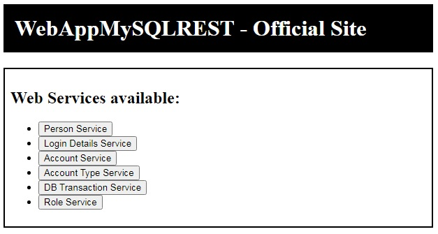
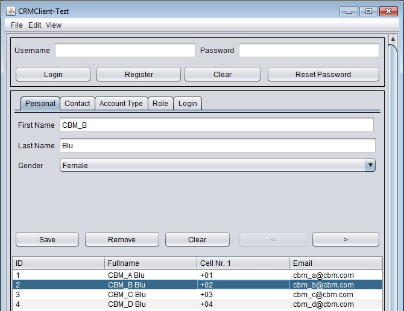

# CRM System (Server & Client)
<h3>A template of a Customer Relations Management System</h3>
<p><center>includes server providing model data and interacting client Desktop Application</center></p>

<a href="https://github.com/Kapiten/WebAppREST/issues">Request Features</a>
<a href="https://github.com/Kapiten/WebAppREST/issues">Report Bug</a>

## Made With
### HTML, CSS, JavaScript


### Angular
```js
function entityAct(entity) {
    app.controller("DBCtrl", 
    function($scope, $http) {
        $scope.saveRecord = function() {
...
        $scope.getRecords = function() {
            $http.get("/WebAppMySQLREST/webresources/com.cbm.web.rest.webappmysqlrest.entity."+entity)
                    .then(function(response){
                        $scope.entity=response.data;
                    });
        };
...
```
### Java
<a href="https://github.com/Kapiten/CRM-Client">CRM-Client</a>


```java
    private void initValues() {
        pnlPersonalDetails = new JPersonalDetailsPanel();
        pnlPersonalContact = new JPersonalContactPanel();
        pnlAccountType = new JGenericDescriptionPanel();
        pnlRole = new JGenericDescriptionPanel();
        pnlLogin = new JLoginPanel();
        panelIndex = 0;
        tbpnlDetails.add("Personal", pnlPersonalDetails);
        tbpnlDetails.add("Contact", pnlPersonalContact);
        tbpnlDetails.add("Account Type", pnlAccountType);
        tbpnlDetails.add("Role", pnlRole);
        tbpnlDetails.add("Login", pnlLogin);
```

